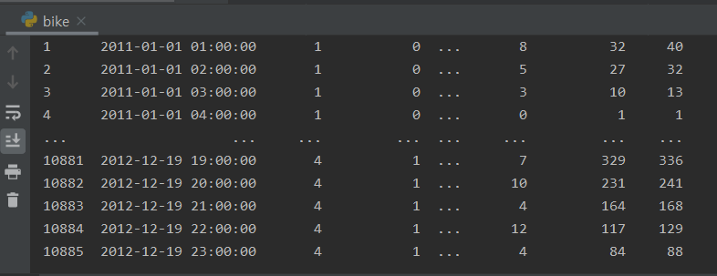
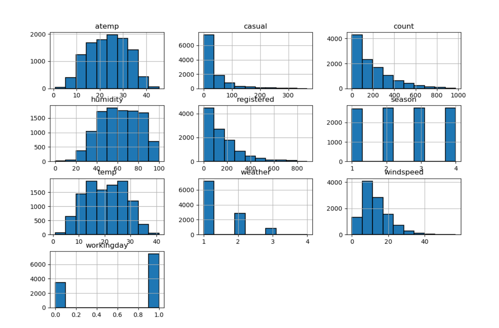
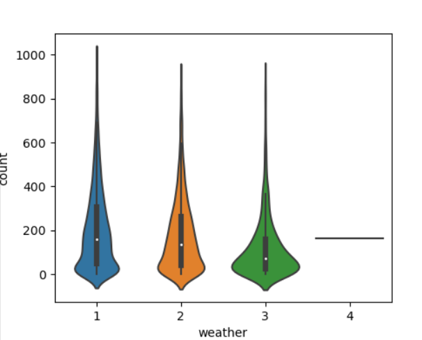
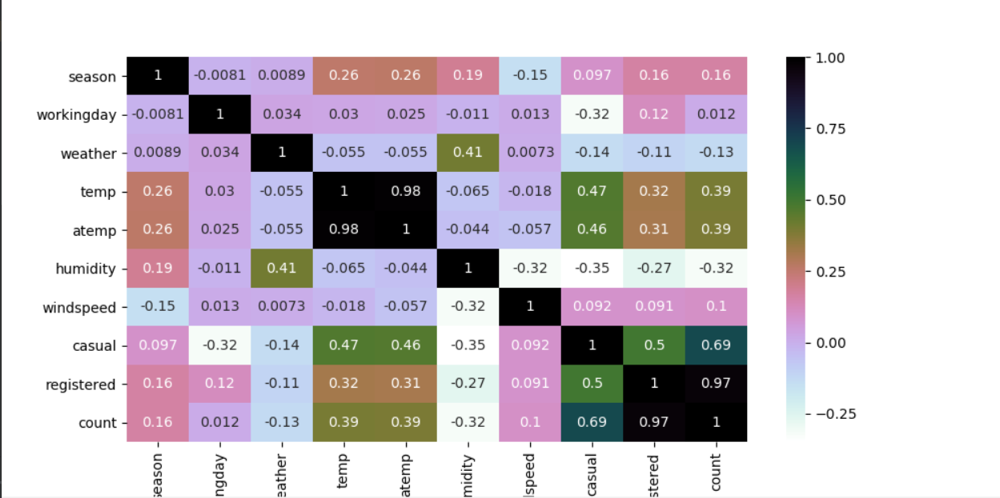

<H1>Bike Sharing Demand </H1> 캐글의 2년간 자전거 임대 데이터를 이용해 날씨별 자전거 임대수요 예측해보기

<H2>데이터 출처</H2>
https://www.kaggle.com/c/bike-sharing-demand
->2년에 걸친 시간별 임대데이터
  

<H2>데이터 필드</H2>

* datetime - 날짜별 시간 + 타임 스탬프
* season - 1 = 봄, 2 = 여름, 3 = 가을, 4 = 겨울 
* weather
  * 1: 맑음, 구름 적음, 부분적으로 흐림
  * 2: 안개 + 흐림, 안개 + 부서진 구름, 안개 + 적은구름, 안개
  * 3: 가벼운 눈, 가벼운 비 + 번개 + 흐림, 가벼운 비 + 흐림
  * 4: 폭우 + 빙판 + 천둥 폭풍 + 안개, 눈 + 안개
* count - 총임대수
  

  

  
<H2>데이터 읽기/정제</H2>
<pre><code>traindata = read("train.csv") # 데이터 읽기
traindata.drop('holiday', axis=1, inplace=True) #필요없는 데이터 없애고 적용</code></pre>

<H2>데이터 시각화/분석</H2>
<pre><code>def myhist(a):   # 데이터를 막대그래프로 시각화
    a.hist(edgecolor='black', linewidth=1.2)
    fig = plt.gcf()
    fig.set_size_inches(12,10)
    plt.show()
    
myhist(traindata) 
</code></pre>

<pre><code>def myviolinplot(df, a, b): # 날씨별 자전거임대수량 바이올린플롯으로 시각화
    plt.figure(figsize=(5,4))
    plt.subplot(1,1,1)
    sns.violinplot(x=a,y=b,data=df)
    plt.show()

myviolinplot(traindata, 'weather', 'count')
</code></pre>

<pre><code>def heatmap(df): # 데이터를 히트맵으로 시각화
    plt.figure(figsize=(10,5))
    sns.heatmap(df.corr(),annot=True,cmap='cubehelix_r')
    plt.show()

heatmap(traindata)
</code></pre>

 
